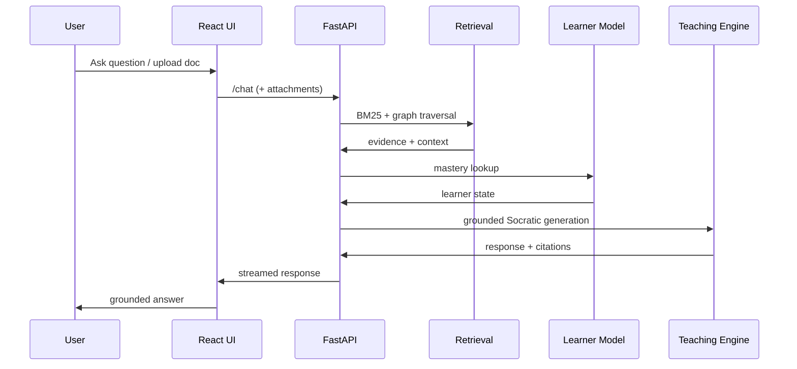
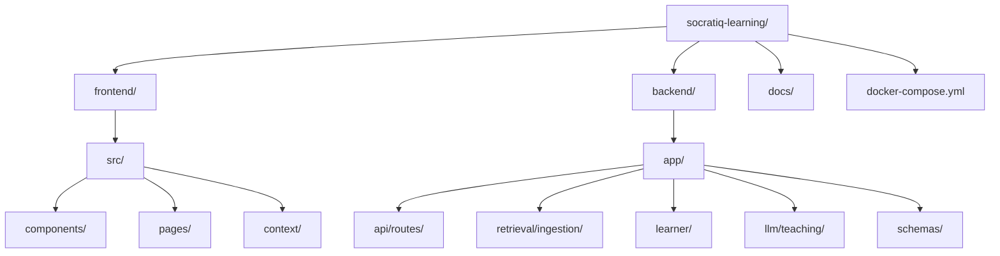

# SocratiQ: Vectorless Research-Grade Learning Assistant

SocratiQ is a production-ready, research-first AI tutoring system centered on vectorless retrieval, a knowledge graph, and a learner model. It provides grounded Socratic teaching with measurable learning outcomes, supporting product features such as a modern React UI, streaming responses, multimodal uploads, and YouTube grounding.

---

## 🚀 Current Project Status: STABLE & PRODUCTION READY

The system has undergone rigorous testing, stabilization, and hardening.
- **Reliability**: Stress-tested for concurrent usage and large document processing.
- **Security**: Hardened with JWT authentication, rate limiting, and strict payload validation.
- **Deployment**: Fully containerized with Docker and Nginx, ready for cloud platforms.
- **Performance**: Optimized retrieval and LLM timeouts for sub-second responsiveness.

---

## 🛠 User Walkthrough: How to Use SocratiQ

### 1. Ingestion & Onboarding
- **Register/Login**: Securely access your personalized learning environment.
- **Upload Knowledge**: Navigate to the **Upload Page** to ingest PDFs, Markdown, or Images. The system will parse and index them into a local Knowledge Graph.

### 2. Socratic Learning
- **Chat**: Ask questions in the **Chat Interface**. The system uses RAG (Retrieval-Augmented Generation) to provide grounded answers using only your uploaded data or verified web fallbacks.
- **Socratic Tutoring**: The AI won't just give answers; it will guide you through concepts, checking your understanding step-by-step.

### 3. Knowledge Validation
- **Generate Quizzes**: Request a quiz on any topic. SocratiQ generates 10 adaptive MCQs based on your mastery level.
- **Timed Testing**: Complete quizzes under a timer to simulate real-world testing conditions.
- **Personalized Feedback**: Receive detailed explanations for every answer, mapped back to the source documents.

### 4. Progress Tracking
- **Learner Dashboard**: Visualize your mastery across different topics.
- **Quiz History**: Review past performance and track your learning gain over time.

---

## 🏗 System Architecture

### Runtime Flow (API Request)



### Data Pipeline

```mermaid
flowchart TD
    subgraph "Ingestion Layer"
        A[File Upload] --> B[Multimodal Parser]
        B --> C[Knowledge Graph Builder]
    end
    subgraph "Retrieval Layer"
        C --> D[Vectorless Index (BM25)]
        D --> E[Graph Traversal]
        E --> F[Hybrid Reranker]
    end
    subgraph "Learning Layer"
        F --> G[Learner Tracker (SQLite)]
        G --> H[Socratic Teaching Agent]
    end
    subgraph "Output Layer"
        H --> I[Grounded Chat]
        H --> J[Adaptive Quiz]
    end
```

### Project Structure



---

## 🐳 Docker Deployment (Recommended)

Run the entire platform with a single command:

```bash
docker-compose up --build -d
```

- **Frontend**: `http://localhost`
- **Backend API**: `http://localhost/api`
- **API Documentation**: `http://localhost/api/docs` 
- **Health Check**: `http://localhost/api/health` 

For detailed cloud deployment instructions (Render, Railway, AWS), see [DEPLOYMENT.md](DEPLOYMENT.md).

---

## 📊 Operations & Maintenance

SocratiQ includes built-in operational features for Phase 8 maintenance:

- **Health Monitoring**: Use `/api/health` for liveness/readiness probes (returns status, DB info, and graph size).
- **Usage Analytics**: View system-wide stats via `/api/analytics/summary` (protected).
- **User Feedback**: Users can submit ratings and feedback directly from their dashboard.
- **Structured Logs**: All LLM interactions and API errors are logged with process durations for performance monitoring.

---

## 💻 Tech Stack

- **Backend**: FastAPI, SQLite (WAL mode), NetworkX, BM25
- **Retrieval**: BM25 + Graph Traversal + Hybrid Reranker
- **Learner Model**: Spaced Repetition + BKT Updates
- **Frontend**: React + Vite, Framer Motion, Lucide
- **Proxy**: Nginx (Production-grade routing)
- **Integrations**: YouTube Data API, Tavily Search, OpenAI/Gemini

---

## 🧪 Research & Evaluation

SocratiQ includes a research harness for measuring learning outcomes:
- **Metrics**: Precision@k, Groundedness, Hallucination Rate, Learning Gain.
- **Reproducibility**: Seeded multi-run evaluations with statistical CI95 summaries.

*To run evaluations, see the commands in the original research documentation.*

---

## ⚠️ Limitations

- **Lexical Bias**: BM25 favors keyword overlap; use descriptive document headings for best results.
- **LLM Dependency**: Requires a valid OpenAI or Gemini API key for advanced reasoning.
- **Local Storage**: Docker setup uses volumes for persistence; ensure your host has sufficient disk space for large libraries.
