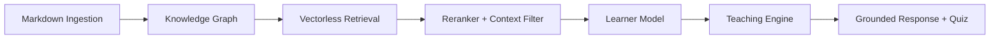
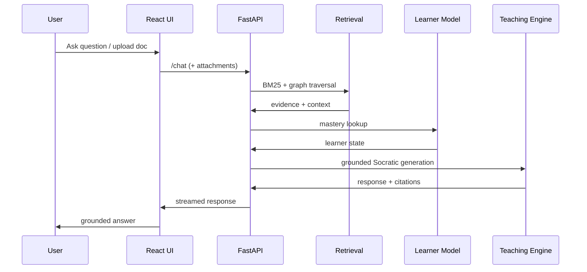

# SocratiQ: Vectorless Research-Grade Learning Assistant

This repository implements a research-first AI tutoring system centered on vectorless retrieval, a knowledge graph, and a learner model. It provides grounded Socratic teaching with measurable learning outcomes, while still supporting product features such as a modern React UI, streaming responses, multimodal uploads, and YouTube grounding.

---

## What This System Does

- Answers learner questions with grounded, evidence-linked explanations.
- Uses BM25 + graph traversal + reranking (no vector DB) for retrieval.
- Tracks learner mastery, weak topics, review schedule, and learning gain.
- Generates adaptive quizzes and Socratic follow-ups.
- Evaluates performance with precision@k, groundedness, hallucination rate, learning gain, and latency.

---

## Core Research Pipeline

1. **Ingestion**  
   Parses structured markdown content and produces concept chunks.

2. **Knowledge Graph**  
   Builds concept nodes and prerequisite/related edges.

3. **Vectorless Retrieval**  
   BM25 + graph traversal + lightweight reranker + strict context filtering.

4. **Learner Model**  
   SQLite-backed mastery tracking, spaced repetition, BKT updates.

5. **Teaching Engine**  
   Grounded Socratic responses + quiz generation with citation mapping.

6. **Evaluation Harness**  
   Multi-run metrics with statistical summaries and reproducible configs.

---

## Product Layer (Secondary)

- React frontend with chat, dashboard, progress views
- Streaming responses with fallback
- Multimodal uploads (PDF/image)
- YouTube grounding (optional via API key)
- Docker + Nginx production deployment

These modules do **not** alter core research logic; they are layered on top.

---

## Architecture Flow (Research Core)



## Runtime Flow (API Request)



---

## Tech Stack

- **Backend**: FastAPI, SQLite, NetworkX, BM25 (rank_bm25)
- **Retrieval**: BM25 + graph traversal + reranker + context filtering
- **Learner model**: spaced repetition + BKT updates
- **Teaching**: Socratic prompting + quiz generation
- **Evaluation**: precision@k, groundedness, hallucination rate, learning gain, latency
- **Frontend**: React + Vite, Framer Motion, Lucide, Markdown rendering
- **Integrations**: YouTube Data API, PDF parsing (pypdf)

---

## Running Locally

### Backend

```bash
pip install -r backend/requirements.txt
uvicorn app.main:app --reload --app-dir backend
```


### Frontend (React)

```bash
npm install --prefix frontend
npm run dev --prefix frontend
```


### Default URLs

- API: `http://localhost:8000`
- React UI: `http://localhost:5173`


---

## Evaluation and Reproducibility

### Build Evaluation Cases

```bash
$env:PYTHONPATH='backend'; python -m backend.app.evaluation.build_cases --data-dir backend/data --output backend/app/evaluation/configs/auto.yaml --max-cases 30
```


### Run Evaluation (multi-run)

```bash
$env:PYTHONPATH='backend'; python -m backend.app.evaluation.run_all --config backend/app/evaluation/configs/auto.yaml --runs 5 --seed 42
```


### Generate Tables for Paper

```bash
$env:PYTHONPATH='backend'; python -m backend.app.evaluation.report --results-dir backend/app/evaluation/results
```


Outputs:

- `backend/app/evaluation/results/summary.csv`
- `backend/app/evaluation/results/summary.md`


---

## Experiment Results (Latest Summary)

The following table is generated from the latest evaluation run:

| Mode | Metric | Mean | Std | CI95 |
| --- | --- | ---: | ---: | ---: |
| llm_only | precision@k | 0.0000 | 0.0000 | 0.0000 |
| llm_only | recall@k | 0.0000 | 0.0000 | 0.0000 |
| llm_only | groundedness | 0.0000 | 0.0000 | 0.0000 |
| llm_only | hallucination_rate | 1.0000 | 0.0000 | 0.0000 |
| llm_only | learning_gain | 0.0000 | 0.0000 | 0.0000 |
| llm_only | latency_ms | 0.0070 | 0.0033 | 0.0012 |
| bm25_only | precision@k | 0.3333 | 0.0000 | 0.0000 |
| bm25_only | recall@k | 1.0000 | 0.0000 | 0.0000 |
| bm25_only | groundedness | 0.3333 | 0.0000 | 0.0000 |
| bm25_only | hallucination_rate | 0.3611 | 0.0632 | 0.0226 |
| bm25_only | learning_gain | 0.3980 | 0.0000 | 0.0000 |
| bm25_only | latency_ms | 0.5957 | 0.4590 | 0.1642 |
| full_system | precision@k | 0.3333 | 0.0000 | 0.0000 |
| full_system | recall@k | 1.0000 | 0.0000 | 0.0000 |
| full_system | groundedness | 0.3333 | 0.0000 | 0.0000 |
| full_system | hallucination_rate | 0.3611 | 0.0632 | 0.0226 |
| full_system | learning_gain | 0.3980 | 0.0000 | 0.0000 |
| full_system | latency_ms | 0.5912 | 0.2281 | 0.0816 |

---

## Research QA Notes (How to Interpret Metrics)

- **precision@k / recall@k**: Retrieval fidelity. Target `precision@k > 0.7` without harming recall.  
- **groundedness**: Evidence alignment. Higher is better; target `> 0.7` with sentence-level grounding.  
- **hallucination_rate**: Unsupported content. Lower is better; target `< 0.25`.  
- **learning_gain**: Mastery improvement estimate. Target `> 0.4` and validate with controlled studies.  
- **latency_ms**: System responsiveness. Keep under 1s for interactive tutoring where possible.

---

## Limitations and Threats to Validity

- **Dataset scope**: Current evaluation cases are generated from in-repo content; results may not generalize.  
- **Grounding proxy**: Groundedness and hallucination rate use heuristic checks; human labeling is required for definitive claims.  
- **Learner gain proxy**: Learning gain is estimated from model dynamics; it does not replace controlled pre/post testing.  
- **Retrieval bias**: BM25 favors lexical overlap and may underperform on paraphrase-heavy queries.  
- **Graph quality**: Graph traversal quality depends on the correctness of concept edges and hierarchy extraction.  
- **Latency variance**: LLM latency depends on external providers and is not fully controlled in evaluation.

---

## Suggested Next Experiments (Research)

1. **Ablation studies**: Remove graph traversal, reranker, or learner model and compare outcomes.  
2. **Embedding baseline**: Add an embedding-RAG baseline to benchmark against vectorless retrieval.  
3. **Human evaluation**: Formal annotation for groundedness and hallucination with inter‑rater agreement.  
4. **Learning study**: Controlled pre/post tests to validate learning gain.  
5. **Domain transfer**: Evaluate on at least two distinct subject datasets.

---

## Claims vs Evidence (Reviewer-Ready)

| Claim | Evidence Type | Current Status | What Strengthens It |
| --- | --- | --- | --- |
| Vectorless retrieval is competitive with vector RAG | Baseline comparison | Partial | Add embedding-RAG baseline and run on multiple domains |
| Graph traversal improves grounding | Ablation + grounding metrics | Partial | Add no-graph ablation and human grounding labels |
| Learner model improves learning gain | Controlled experiment | Weak | Pre/post tests with randomized groups |
| Socratic prompting reduces hallucination | Human eval + hallucination rate | Weak | Sentence-level labeling with inter-rater agreement |
| System is reproducible | Multi-run evaluation + config files | Moderate | CI evaluation runs and artifact versioning |

---

## API Endpoints

- `GET /health`
- `POST /ingest`
- `POST /chat` (mode: `socratic` or `quiz`)
- `POST /chat/stream`
- `POST /quiz/submit`
- `POST /quiz/generate`
- `POST /files/upload`
- `POST /search/youtube`
- `GET /learner/progress`

---

## Environment Variables

- `OPENAI_API_KEY` or `GEMINI_API_KEY` for LLM responses
- `YOUTUBE_API_KEY` for YouTube grounding
- `JWT_SECRET_KEY` for auth
- `CORS_ORIGINS` for frontend origins

---

## Production Run

```bash
docker compose -f docker-compose.prod.yml up --build
```

Default URL:

- `http://localhost` (API served under `/api`)

